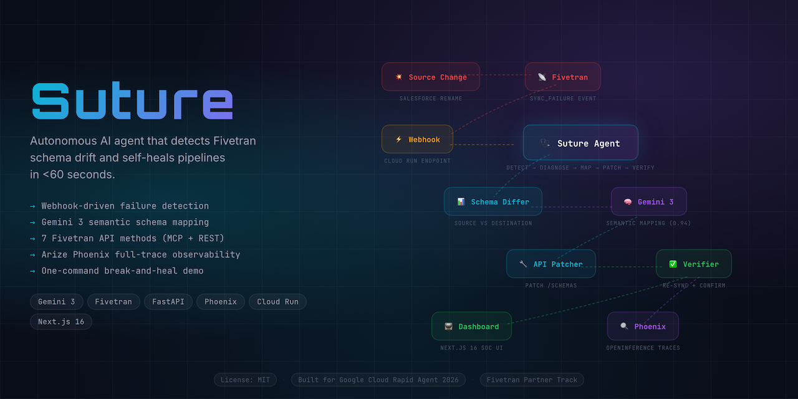
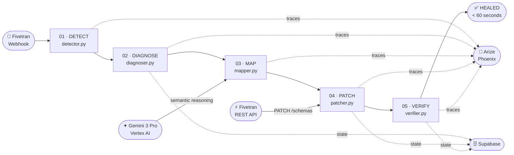

<div align="center">
  <h1>Suture 🩺</h1>
  <p><em>Autonomous AI agent that detects and self-heals broken Fivetran syncs in under 60 seconds.</em></p>
  

  <br/>

  [](https://suture.edycu.dev)
  [](https://suture.edycu.dev/pitch-deck)
  [](https://youtu.be/suture-demo)
  [](https://rapid-agent.devpost.com/)

  <br/>

  
  
  
  
  
  
  [](https://github.com/edycutjong/suture/actions/workflows/ci.yml)

</div>

---

## 📸 See it in Action

<div align="center">
  
</div>

> **Self-healing infrastructure in action.** Schema Break → Webhook → Log Analysis → Schema Diff → AI Reasoning → API Patch → Re-Sync → ✅ GREEN.

---

## 💡 The Problem & Solution

Schema drift is the #1 cause of data pipeline failures. When an upstream source changes its API schema — renaming columns, adding fields, or deprecating endpoints — downstream Fivetran connectors break silently. The current fix is manual: 2-4 hours of comparing schemas, guessing mappings, and hoping nothing else breaks.

**Average cost per incident: $500–$2,000 in engineering time + data downtime.**

**Suture** solves this by turning Fivetran into a self-healing infrastructure.

**Key Features:**
- ⚡ **Autonomous Healing:** Detects and patches drift in under 60 seconds without human intervention.
- 🧠 **Semantic Reasoning:** Uses Gemini 3 Pro to understand context, avoiding blind string-matching errors.
- 🛡️ **Observability:** Military-grade SOC dashboard providing real-time oversight of the healing pipeline.

## 🏗️ Architecture & Tech Stack



| Layer | Technology |
|---|---|
| **Agent** | Python 3.12, FastAPI |
| **AI** | Gemini 3 Pro (Vertex AI) |
| **Data** | Fivetran REST API (7 methods) |
| **Observability** | Arize Phoenix |
| **Dashboard** | Next.js 16, React 19, Tailwind v4 |
| **Database** | Supabase (PostgreSQL + Realtime) |
| **Deploy** | Cloud Run (agent) + Vercel (dashboard) |

## 🏆 Sponsor Tracks Targeted

- **Fivetran Partner Track ($5,000):** Deep integration with Fivetran's API to manage syncs and modify table mappings programmatically.
- **Grand Prize ($20,000):** Pushing the boundaries of autonomous AI agents in mission-critical infrastructure.

## 🚀 Getting Started

### Prerequisites
- Node.js ≥ 20
- npm
- Python 3.12

### Installation
1. Clone: `git clone https://github.com/edycutjong/suture.git`
2. Set up agent:
   ```bash
   cd agent && pip install -r requirements.txt
   ```
3. Set up dashboard:
   ```bash
   cd ../dashboard && npm install
   ```
4. Configure: `cp .env.example .env.local` (dashboard) and `cp .env.example .env` (agent), then add your API keys.
5. Run: `npm run dev` (in dashboard) and `uvicorn main:app` (in agent).

> **For Judges:** Watch the automated demo pipeline!
> `python scripts/seed.py` (Setup healthy pipeline)
> `python scripts/break_schema.py` (Simulate drift)

## 🧪 Testing & CI

```bash
# Dashboard
cd dashboard
npm run lint          # ESLint
npm run typecheck     # TypeScript check
npm run test:coverage # Coverage report
npm run ci            # Full CI pipeline

# Agent
cd agent
pytest --cov          # Run Python tests
```

## 📁 Project Structure

```
suture/
├── agent/            # Python FastAPI agent (webhook listener, schema differ, Gemini reasoner)
├── dashboard/        # Next.js 16 App Router (status dashboard, schema diff viewer)
├── docs/             # README assets (hero, screenshots)
├── scripts/          # Demo scripts (seed, break, verify)
├── data/             # Deterministic test fixtures (Salesforce schemas)
├── db/               # Supabase schema (pipelines, incidents, config)
├── .github/          # CI workflows
└── README.md         # You are here
```

## 📄 License
[MIT](LICENSE) © 2026 Edy Cu

## 🙏 Acknowledgments
Built for Google Cloud Rapid Agent Hackathon 2026. Thank you to Fivetran and Google Cloud for the APIs and tools.
