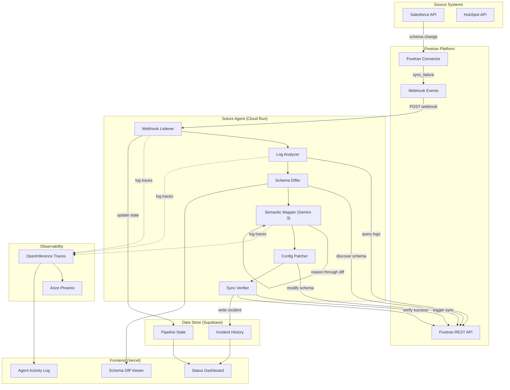
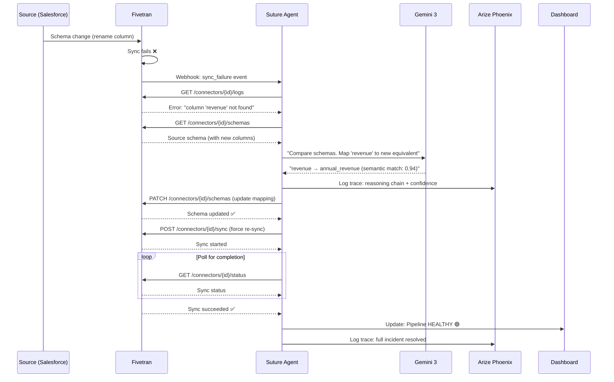

# Suture — Technical Architecture

## Tech Stack

| Layer | Technology | Justification |
|-------|-----------|---------------|
| **Agent Runtime** | Python 3.12 + FastAPI | Gemini SDK native support, async event handling |
| **AI Model** | Gemini 3 Pro (via Vertex AI) | Required by hackathon; structured output generation for schema mappings |
| **Data Integration** | Fivetran REST API | Primary sponsor — schema management, sync control, log queries |
| **Observability** | Arize Phoenix (OpenInference) | Agent trace logging, self-improvement loop, bonus track eligibility |
| **Frontend** | Next.js 16 (App Router) | Status dashboard, schema diff viewer, agent activity log |
| **Styling** | Tailwind CSS v4 | Rapid premium dark-mode UI development |
| **Database** | Supabase (PostgreSQL) | Pipeline state, incident history, agent config |
| **Hosting (Agent)** | Google Cloud Run | Serverless webhook listener, auto-scales to zero |
| **Hosting (Frontend)** | Vercel | Instant deploys, global CDN |
| **Mock System** | Local FastAPI mock server | Simulates Fivetran API for reliable demos |

## System Architecture



## Agent Reasoning Flow



## Database Schema (Supabase)

```sql
-- Pipeline state tracking
CREATE TABLE suture_pipelines (
    id UUID PRIMARY KEY DEFAULT gen_random_uuid(),
    fivetran_connector_id TEXT NOT NULL UNIQUE,
    connector_name TEXT NOT NULL,
    source_type TEXT NOT NULL,         -- 'salesforce', 'hubspot', 'stripe', etc.
    destination_type TEXT NOT NULL,     -- 'bigquery', 'snowflake', etc.
    status TEXT NOT NULL DEFAULT 'healthy', -- 'healthy', 'broken', 'healing', 'healed'
    last_sync_at TIMESTAMPTZ,
    last_schema_diff JSONB,
    created_at TIMESTAMPTZ DEFAULT NOW(),
    updated_at TIMESTAMPTZ DEFAULT NOW()
);

-- Incident history
CREATE TABLE suture_incidents (
    id UUID PRIMARY KEY DEFAULT gen_random_uuid(),
    pipeline_id TEXT NOT NULL REFERENCES suture_pipelines(fivetran_connector_id) ON DELETE CASCADE,
    error_type TEXT NOT NULL,          -- 'schema_drift', 'auth_failure', 'rate_limit'
    error_message TEXT,
    source_schema JSONB,               -- schema snapshot at time of failure
    destination_schema JSONB,          -- schema snapshot at time of failure
    ai_reasoning TEXT,                 -- Gemini's full reasoning chain
    applied_patch JSONB,               -- the schema modification applied
    confidence_score FLOAT,            -- AI confidence in the mapping (0-1)
    resolution_time_ms INTEGER,        -- time from detection to green
    status TEXT NOT NULL DEFAULT 'detected', -- 'detected', 'diagnosing', 'patching', 'resolved', 'failed'
    arize_trace_id TEXT,               -- link to Phoenix trace
    created_at TIMESTAMPTZ DEFAULT NOW(),
    resolved_at TIMESTAMPTZ
);

-- Agent configuration (key-value store)
CREATE TABLE suture_config (
    id UUID PRIMARY KEY DEFAULT gen_random_uuid(),
    key TEXT NOT NULL UNIQUE,
    value JSONB NOT NULL,
    updated_at TIMESTAMPTZ DEFAULT NOW()
);

-- RLS Policies
ALTER TABLE suture_pipelines ENABLE ROW LEVEL SECURITY;
ALTER TABLE suture_incidents ENABLE ROW LEVEL SECURITY;
ALTER TABLE suture_config ENABLE ROW LEVEL SECURITY;

CREATE POLICY "Allow public read on pipelines" ON suture_pipelines FOR SELECT USING (true);
CREATE POLICY "Allow public read on incidents" ON suture_incidents FOR SELECT USING (true);
CREATE POLICY "Allow service write on pipelines" ON suture_pipelines FOR ALL USING (true);
CREATE POLICY "Allow service write on incidents" ON suture_incidents FOR ALL USING (true);
CREATE POLICY "Allow service write on config" ON suture_config FOR ALL USING (true);
```

## API Endpoints (FastAPI)

| Method | Path | Description |
|--------|------|-------------|
| `POST` | `/webhook/fivetran` | Receive Fivetran sync failure webhooks |
| `GET` | `/api/pipelines` | List all monitored pipelines with status |
| `GET` | `/api/pipelines/{id}` | Get pipeline details + incident history |
| `GET` | `/api/incidents` | List all incidents with resolution details |
| `GET` | `/api/incidents/{id}` | Get incident detail including AI reasoning |
| `POST` | `/api/heal/{pipeline_id}` | Manually trigger heal for a pipeline |
| `GET` | `/api/health` | Agent health check |
| `GET` | `/api/stats` | Dashboard stats (total healed, avg resolution time) |

## Fivetran API Surface (5+ Methods)

| Method | Fivetran Endpoint | Purpose |
|--------|------------------|---------|
| `list_connectors` | `GET /v1/connectors` | Enumerate all monitored pipelines |
| `get_connector_details` | `GET /v1/connectors/{id}` | Get connector config and status |
| `discover_schema` | `GET /v1/connectors/{id}/schemas` | Retrieve current source schema |
| `modify_schema` | `PATCH /v1/connectors/{id}/schemas` | Apply schema mapping fix |
| `trigger_sync` | `POST /v1/connectors/{id}/force` | Force a re-sync after patching |
| `get_sync_logs` | `GET /v1/connectors/{id}/logs` | Query sync failure error messages |
| `get_connector_state` | `GET /v1/connectors/{id}/state` | Check sync completion status |

## Arize Phoenix Integration (4 Methods)

| Method | Purpose |
|--------|---------|
| `log_traces` | Send OpenInference-format traces of agent reasoning |
| `query_spans` | Find past diagnostic traces for pattern detection |
| `get_evaluations` | Retrieve evaluation scores on diagnostic accuracy |
| `compare_runs` | Before/after comparison of agent performance |

## Key Libraries

```txt
# Agent
google-genai>=1.0.0          # Gemini 3 SDK
fastapi>=0.115.0              # API server
uvicorn>=0.30.0               # ASGI server
httpx>=0.27.0                 # Async HTTP client (Fivetran API)
pydantic>=2.0.0               # Data validation
supabase>=2.0.0               # Database client

# Observability
arize-phoenix>=5.0.0          # Phoenix client
openinference-instrumentation>=0.1.0  # Auto-instrumentor

# Frontend (Next.js)
next@16                       # Framework
react@19                      # UI
recharts                      # Charts
tailwindcss@4                 # Styling
```

## Project Structure

```
suture/
├── agent/                     # Python FastAPI agent
│   ├── main.py               # FastAPI app + webhook listener
│   ├── core/
│   │   ├── detector.py        # Sync failure detection
│   │   ├── diagnoser.py       # Log analysis + schema diff
│   │   ├── mapper.py          # Gemini semantic mapping
│   │   ├── patcher.py         # Fivetran API mutations
│   │   └── verifier.py        # Re-sync + confirmation
│   ├── clients/
│   │   ├── fivetran.py        # Fivetran REST API client
│   │   ├── gemini.py          # Gemini 3 client
│   │   ├── phoenix.py         # Arize Phoenix client
│   │   └── supabase.py        # Database client
│   ├── models/
│   │   └── schemas.py         # Pydantic models
│   └── tests/
│       ├── test_detector.py
│       ├── test_diagnoser.py
│       ├── test_mapper.py
│       ├── test_patcher.py
│       └── test_verifier.py
├── dashboard/                 # Next.js 16 frontend
│   ├── src/app/
│   │   ├── globals.css        # Global CSS styles
│   │   ├── layout.tsx         # Dashboard layout wrapper
│   │   └── page.tsx           # Main dashboard UI page
│   ├── src/components/
│   │   ├── PipelineCard.tsx
│   │   ├── SchemaDiffViewer.tsx
│   │   ├── AgentActivityLog.tsx
│   │   ├── IncidentTimeline.tsx
│   │   └── StatusBadge.tsx
│   └── src/lib/
│       ├── types.ts
│       └── api.ts
├── scripts/
│   ├── seed.py                # Creates a broken pipeline for demo
│   ├── break_schema.py        # Renames a column to trigger failure
│   ├── bench.py               # Performance benchmarks
│   └── verify_demo.py         # Verifies demo works end-to-end
├── data/
│   └── fixtures/
│       ├── salesforce_schema_before.json
│       ├── salesforce_schema_after.json
│       └── mock_sync_logs.json
├── docs/
│   ├── DEMO.md
│   └── ARCHITECTURE.md
├── Dockerfile                 # Agent container
├── requirements.txt
├── LICENSE                    # MIT (required by hackathon)
└── README.md
```

## Deployment Architecture

```
graph LR
    subgraph "Google Cloud"
        CR["Cloud Run (Agent)"]
        AR["Artifact Registry"]
    end

    subgraph "Vercel"
        VE["Next.js Dashboard"]
    end

    subgraph "External Services"
        FT["Fivetran (SaaS)"]
        PH["Arize Phoenix (SaaS)"]
        SB["Supabase (SaaS)"]
    end

    FT -->|webhook| CR
    CR -->|API calls| FT
    CR -->|traces| PH
    CR -->|read/write| SB
    VE -->|proxy| CR
    VE -->|read| SB
    AR -->|image| CR
```

## Boilerplate Recommendation

No existing boilerplate matches this pattern. Start from scratch:
- `agent/`: `pip install fastapi uvicorn google-genai httpx`
- `dashboard/`: `npx -y create-next-app@latest ./dashboard --ts --tailwind --app --src-dir --no-import-alias`
