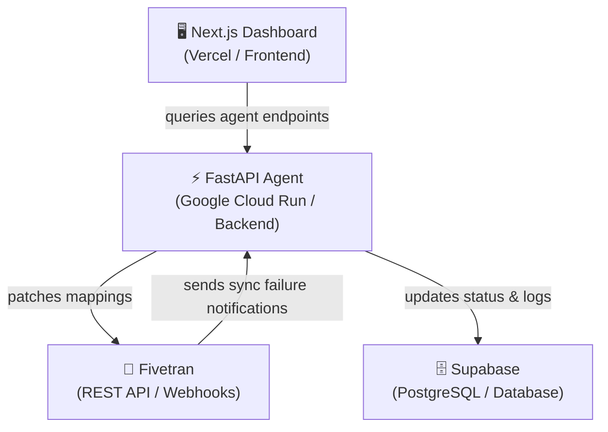

# Suture — Deployment Guide 🩺

This guide outlines the step-by-step process for deploying the Suture autonomous pipeline healer to production environments.

---

## 🏗️ Deployment Architecture



1. **Backend Agent**: Deployed as a serverless container on **Google Cloud Run**.
2. **Frontend Dashboard**: Deployed on **Vercel** as a Next.js static site or serverless application.
3. **Database**: Hosted on **Supabase** (PostgreSQL) for storing pipeline configurations, incidents, and audit trails.

---

## 1. Supabase Setup (Database)

Ensure your database tables are initialized before deploying the services:

1. Go to your **Supabase Dashboard** → **SQL Editor**.
2. Copy and run the schema setup SQL from `db/schema.sql` to create the essential tables:
   - `pipelines` (connector sync configuration metadata)
   - `incidents` (records of detected drift and heal details)
   - `config` (agent-specific parameter definitions)
3. Ensure Row Level Security (RLS) is enabled and appropriate public read policies are in place if the dashboard accesses them.

---

## 2. Backend Agent Deployment (Google Cloud Run)

The Suture backend is built using FastAPI and containerized via Docker.

### Prerequisites
- Google Cloud SDK (`gcloud` CLI) installed and authenticated.
- Active GCP project (e.g. `gen-lang-client-0466446073`).

### Deployment Steps
1. Navigate to the `agent` folder:
   ```bash
   cd agent
   ```
2. Deploy the container from source to Cloud Run:
   ```bash
   gcloud run deploy suture-agent \
     --source . \
     --region asia-southeast2 \
     --allow-unauthenticated \
     --project gen-lang-client-0466446073 \
     --set-env-vars "FIVETRAN_API_KEY=your_key,FIVETRAN_API_SECRET=your_secret,GEMINI_API_KEY=your_key,SUPABASE_URL=your_supabase_url,SUPABASE_SERVICE_ROLE_KEY=your_key,AGENT_MODE=live"
   ```
3. Once completed, the CLI will output your live **Service URL**:
   `https://suture-agent-173492208631.asia-southeast2.run.app`

> 💡 **Tip**: Use `agent/.env.production` (ignored by Git) on your local machine to keep a record of these keys for future updates.

---

## 3. Frontend Dashboard Deployment (Vercel)

The Next.js dashboard compiles into a static asset build.

### Prerequisites
- Vercel CLI installed (`npm install -g vercel`) or connected to GitHub.

### Deployment Steps
1. Navigate to the `dashboard` folder:
   ```bash
   cd dashboard
   ```
2. Run Vercel setup and define environment variables:
   ```bash
   vercel
   ```
3. Configure the following environment variables in Vercel settings:
   - `NEXT_PUBLIC_AGENT_URL`: Your live Google Cloud Run URL (e.g. `https://suture-agent-173492208631.asia-southeast2.run.app`)

---

## 4. Webhook Routing Configuration

To enable automated healing, connect Fivetran webhook alerts to your live agent:

1. In the **Fivetran Dashboard**, navigate to **Account Settings** → **General** → **Webhooks**.
2. Click **Add Webhook**.
3. Set the destination URL to:
   `https://suture-agent-173492208631.asia-southeast2.run.app/webhook/fivetran`
4. Select the event triggers: `sync_failure` (and optional metadata changes).

---

## 5. Post-Deployment Verification

Verify that your services are connected and responsive:

- **Check Backend Health**:
  ```bash
  curl https://suture-agent-173492208631.asia-southeast2.run.app/api/health
  ```
  Expected response:
  ```json
  {"status":"online","version":"1.0.0","mode":"live","uptime_seconds":...}
  ```

- **Verify Frontend Connection**:
  Load your deployed Vercel URL and check that it successfully connects to the backend and fetches the real-time Fivetran stats.
